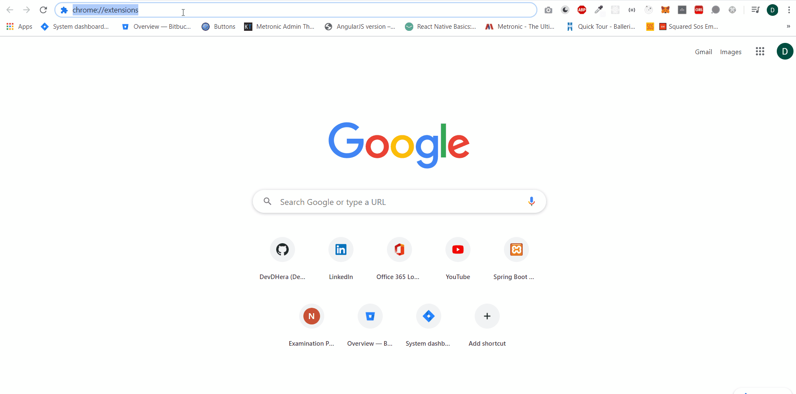

[![Issue Status][issue status badge]][issue status link] [![License Status][license status badge]][license status link] [![Fork Status][fork status badge]][fork status link]

<!-- markdownlint-disable -->

<!-- markdownlint-enable -->

[issue status badge]: https://img.shields.io/github/issues/DevDHera/COVID-19-Chrome-Extension
[issue status link]: https://github.com/DevDHera/COVID-19-Chrome-Extension/issues
[license status badge]: https://img.shields.io/github/license/DevDHera/COVID-19-Chrome-Extension
[license status link]: https://github.com/DevDHera/COVID-19-Chrome-Extension/blob/master/LICENSE
[fork status badge]: https://img.shields.io/github/forks/DevDHera/COVID-19-Chrome-Extension
[fork status link]: https://github.com/DevDHera/COVID-19-Chrome-Extension/network/members

# COVID-19 - Stats (SL)

This project is focusing on providing easy access to COVID-19 stats via a browser extension.

[Angular](https://angular.io/) framework is used to build out this extension and it contains features such as,

- Frequently updated stats cards
- Charts

and much more.

## Summary

- [Getting Started](#getting-started)
- [Runing the tests](#running-the-tests)
- [Deployment](#deployment)
- [Built With](#built-with)
- [Contributing](#contributing)
- [Authors](#authors)
- [License](#license)
- [Acknowledgments](#acknowledgments)

## Getting Started

Getting started with the `COVID-19-Chrome-Extension` is easy.

1. First clone the project.

```sh
git clone https://github.com/DevDHera/COVID-19-Chrome-Extension.git
```

2. Go to the root of your cloned project and install the dependencies.

```sh
npm install
```

3. Start the project.

```sh
npm start
```

4. Now go to `chrome://extensions` in the browser and enable `'developer mode'`.

5. Simply load your extension by pressing `Load unpacked` and target the folder `angular/dist`.



5. Now head over to our [issue board](https://github.com/DevDHera/COVID-19-Chrome-Extension/issues) and help solving issues 👼.

### Prerequisites

`COVID-19-Chrome-Extension` uses **[Angular](https://angular.io/)** to manage codebase.

In order to successfully run the project install the following.

- Node.js

### Configurations

After setting up the above you can add multiple sources to get the stats using `environment` files.

Following is the structure that we are using.

```ts
export const environment = {
  production: false,
  apiUrl: 'YOUR_API_URL',
  csvUrl: 'YOUR_CSV_DATA_URL',
};
```

## Deployment

To do a production build of your extension first you need to update the version number inside `./angular/src/manifest.json`.

```json
{
  "manifest_version": 2,
  "name": "COVID 19 - Stats (SL)",
  "short_name": "COVID 19 - Stats (SL)",
  "version": "YOUR_VERSION_NUMBER",
  "description": "Get latest situation reports of COVID-19 in Sri Lanka",
  "permissions": ["activeTab"],
  "browser_action": {
    "default_popup": "index.html?#/popup",
    "default_title": "Angular Chrome Extension"
  },
  "content_scripts": [
    {
      "js": ["contentPage.js"],
      "matches": ["<all_urls>"]
    }
  ],
  "background": {
    "scripts": ["backgroundPage.js"],
    "persistent": false
  },
  "content_security_policy": "script-src 'self' 'unsafe-eval'; object-src 'self'",
  "icons": {
    "16": "assets/img/logo/logo-16x16.png",
    "32": "assets/img/logo/logo-24x24.png",
    "48": "assets/img/logo/logo-32x32.png",
    "128": "assets/img/logo/logo-128x128.png"
  }
}
```

Now simply run the below command build and zip the extension.

```sh
npm run build:production
```

After running the above you will get `extension-build.zip` in the root folder. You can upload it to the [Chrome Web Store](https://chrome.google.com/webstore/developer/dashboard).

## Built With

- [Angular](https://angular.io/) - The UI framework used
- [ng-chrome-extension](https://github.com/larscom/ng-chrome-extension) - Extension Scaffolder
- [Bootstrap](https://getbootstrap.com/) - Front-end component lib
- [ngx-bootstrap](https://valor-software.com/ngx-bootstrap/#/) - Bootstrap wrapper for Angular
- [ngx-papaparse](https://github.com/alberthaff/ngx-papaparse) - CSV parser
- [Chart.js](https://www.chartjs.org/) - Chart lib

## Contributing

Please read [CODE_OF_CONDUCT.md](https://github.com/DevDHera/COVID-19-Chrome-Extension/blob/master/CODE_OF_CONDUCT.md) for details on our code of conduct, and the process for submitting pull requests to us.

## Authors

- **Devin Herath** - _Initial work_ - [DevDHera](https://github.com/DevDHera)

See also the list of [contributors](https://github.com/DevDHera/COVID-19-Chrome-Extension/graphs/contributors) who participated in this project.

## License

This project is licensed under the MIT License - see the [LICENSE](https://github.com/DevDHera/COVID-19-Chrome-Extension/blob/master/LICENSE) file for details.

## Acknowledgments

- [Lars Kniep](https://github.com/larscom) for awesome CLI to generate Angular scaffolds ❤
- [Arimac](https://github.com/arimacdev) for all the endpoints you guys made available ❤
- [PurpleBooth](https://github.com/PurpleBooth) for this awesome README template ❤
